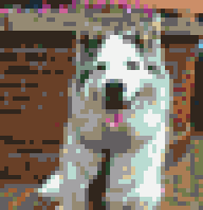

# LEGOMosaics in Python

## Introduction
This is an implementation of [**Ryan Timpe's LEGOMosaics**](https://github.com/ryantimpe/LEGOMosaics) in Python using Pillow and Pandas. Currently you can take an image and convert it to a groups of bricks [4x2, 2x2, 1x1] based on the [Offical LEGO color palette](http://www.bartneck.de/wp-content/uploads/2016/09/2016-LEGO-color-palette.pdf) excluding metallic, transparent, and glow bricks.  

    LEGO_run.image_to_lego_colors('Images/bobcatbrick.jpg')

    LEGO_run.image_to_lego_bricks('Images/bobcatbrick.jpg')

    LEGO_run.image_to_large_lego_bricks('Images/bobcatbrick.jpg')

## In development
  - Better Readme and code walkthrough
  - Improved Brick Grouper
  - Instructions
  - Piece Count

