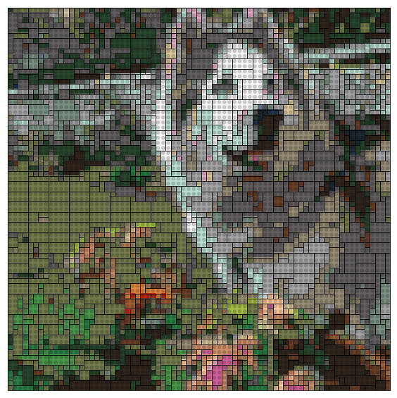

# LEGOMosaics in Python

## Introduction
This is an implementation of [**Ryan Timpe's LEGOMosaics**](https://github.com/ryantimpe/LEGOMosaics) in Python using Pillow and pandas. Currently you can take a .jpg image and convert it to a groups of bricks [4x2, 2x2, 1x1] based on the [Offical LEGO color palette](http://www.bartneck.de/wp-content/uploads/2016/09/2016-LEGO-color-palette.pdf) excluding metallic, transparent, and glow bricks.  

    LEGO_run.image_to_lego_bricks('Images/bobcatflower.jpg', n_w=75)
